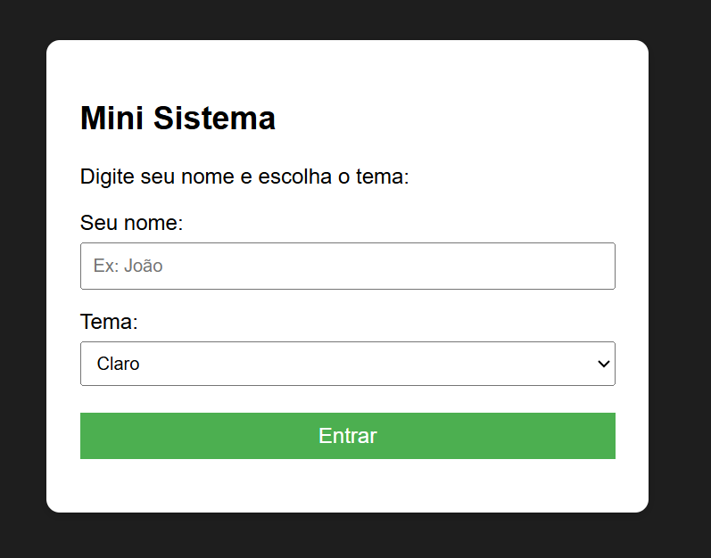
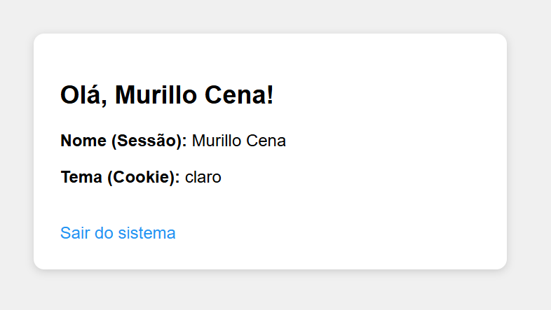

# Mini Sistema PHP - Sessão e Cookie

## Como ficou:

---

## Sobre o projeto

Esse é um mini sistema que eu fiz em PHP pra praticar o uso de **sessão** e **cookie**.

A ideia é bem simples:
- A pessoa digita o nome
- Escolhe o tema (claro ou escuro)
- Entra num painel que mostra essas informações
- Pode sair quando quiser

---

## Como funciona

1. Na página inicial a pessoa coloca o nome e escolhe o tema
2. Quando clica em **Entrar**:
   - O nome é salvo na **sessão**
   - O tema é salvo no **cookie** (fica guardado por 30 dias)
3. Depois ela vai pro painel, onde aparece o nome e o tema escolhido
4. Tem um botão de sair que apaga a sessão e volta pro início

Se tentar abrir o painel sem ter feito login, o sistema manda de volta pra página inicial.

---

## Arquivos do projeto

| Arquivo       | O que faz                                      |
|---------------|------------------------------------------------|
| `config.php`  | Inicia a sessão e tem a função do cookie       |
| `header.php`  | Define as cores do tema e o visual da página   |
| `index.php`   | Página de entrada (formulário)                 |
| `painel.php`  | Página principal depois do login               |
| `logout.php`  | Apaga a sessão e sai do sistema                |

---

## O que eu aprendi

- **Sessão**: guarda o nome só enquanto a pessoa está navegando. Quando fecha o navegador ou clica em sair, some.
- **Cookie**: guarda o tema no computador da pessoa. Mesmo fechando o navegador, o tema continua salvo.

Também usei `htmlspecialchars()` pra mostrar o nome de forma mais segura.

---

## Como testar

1. Coloca os arquivos numa pasta do servidor (XAMPP, Laragon, etc)
2. Acessa o `index.php` no navegador
3. Digita um nome, escolhe o tema e clica em Entrar

---

## Observação

Projeto feito pra atividade da escola. É bem simples, mas serve pra entender a diferença entre sessão e cookie na prática.