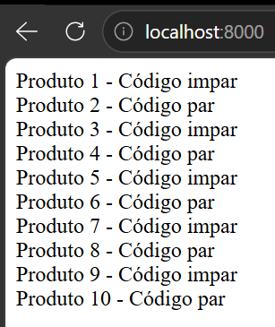

`Site:`
---



`Código:`
---


```bash
 <?php
    for ($i = 1; $i <= 10; $i++) {
        if ($i % 2 == 0) {
            echo "Produto $i - Código par<br>";
        } else {
            echo "Produto $i - Código impar<br>";
        }
    }
?>
```