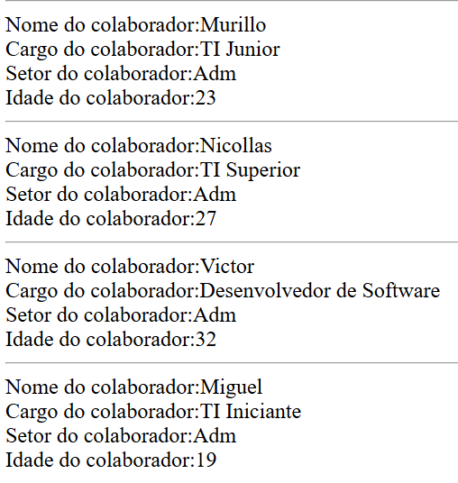

# Cadastro de Funcionários em PHP



## Sobre a atividade

Neste código foi criado um pequeno cadastro de funcionários utilizando **PHP**.

As informações de cada funcionário foram armazenadas dentro de um array, contendo:

* Nome;
* Cargo;
* Setor;
* Idade.

## Como funciona

O array `$funcionarios` guarda os dados de todos os colaboradores.

Exemplo:

```php
["nome" => "Murillo",
 "cargo" => "TI Junior",
 "setor" => "Adm",
 "idade" => "23"]
```

Depois, foi utilizado o `foreach` para passar por todos os funcionários e mostrar as informações de cada um na tela.

```php
foreach($funcionarios as $f) {
    echo "Nome do colaborador:". $f["nome"], "<br>";
    echo "Cargo do colaborador:". $f["cargo"], "<br>";
    echo "Setor do colaborador:". $f["setor"], "<br>";
    echo "Idade do colaborador:". $f["idade"], "<br>";
    echo "<hr>";
}
```

O `<br>` serve para quebrar a linha entre as informações e o `<hr>` cria uma linha para separar um funcionário do outro.

## O que foi aprendido

Com essa atividade foi possível praticar:

* Arrays em PHP;
* Arrays associativos;
* Uso do `foreach`;
* Uso do `echo`;
* Exibição e organização de informações na tela.

## Conclusão

Essa atividade ajudou a entender melhor como guardar vários dados em um array e como utilizar o `foreach` para mostrar essas informações de forma simples e organizada.
