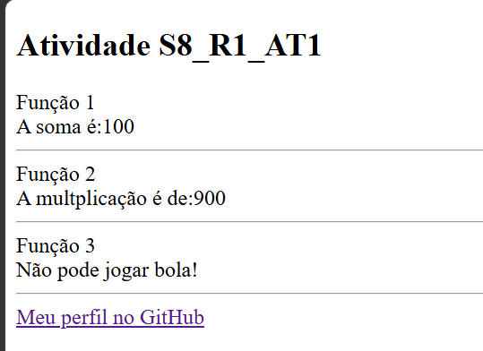
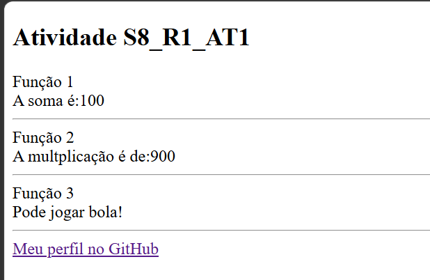

# Atividade S8_R1_AT1 — Funções em PHP

## Sobre a atividade

Nessa atividade, eu usei **HTML e PHP** para praticar a criação de funções. Fiz duas funções para realizar contas matemáticas, uma para verificar a idade de uma pessoa e também coloquei o link do meu GitHub no final da página.

## Como ficou


---


---

## Funções criadas

### Função de adição

A função `adicao` recebe dois números e faz a soma entre eles. Nesse exemplo, usei os números 10 e 90, e o resultado foi **100**.

### Função de multiplicação

A função `multi` também recebe dois números, mas faz a multiplicação. Foram usados os números 100 e 9, resultando em **900**.

### Função de verificação de idade

A função `verif` verifica a idade da pessoa. Se ela tiver 15 anos ou mais, aparece a mensagem **“Pode jogar bola!”**. Se tiver menos de 15 anos, aparece **“Não pode jogar bola!”**.

No código, coloquei a idade 11, então a pessoa não pode jogar bola.

## Tecnologias utilizadas

* HTML;
* PHP;
* XAMPP para executar o código.

## Como acessar o projeto

1. Baixe e instale o XAMPP.
2. Coloque a pasta do projeto dentro da pasta `htdocs`.
3. Abra o XAMPP e ligue o Apache.
4. Depois, abra o navegador e digite:

```text
http://localhost/nome-da-pasta
```

## O que eu aprendi

Com essa atividade, consegui praticar melhor como criar funções em PHP, usar parâmetros, fazer contas, criar condições com `if` e `else` e mostrar informações na tela usando o `echo`. Também aprendi como colocar um link dentro de uma página usando uma variável.

## Autor

Feito por **Murillo Bastos Cena**.

[Meu perfil no GitHub](https://github.com/MurilloBastos7)
