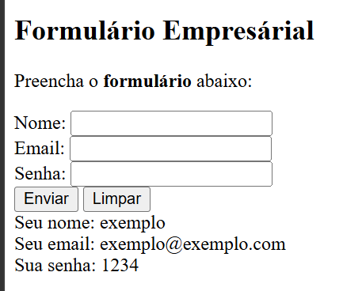

# Formulário Empresarial

## Sobre a atividade

Nesta atividade, eu criei um formulário empresarial simples usando HTML e PHP. A ideia foi fazer uma página onde a pessoa consegue colocar o nome, o e-mail e a senha dela.

## Como ficou:



---

## Cógido:

```php
<!DOCTYPE html>
<html lang="pt-BR">
<head>
    <meta charset="UTF-8">
    <meta name="viewport" content="width=device-width, initial-scale=1.0">
    <!-- Coloquei o título da página -->
    <title>Formulario</title>
</head>
<!-- Coloquei o titulo e uma frase explicando o formulário -->
<h2>Formulário Empresárial</h2>
<p>Preencha o <b>formulário</b> abaixo:</p>
<body>
     <!-- Criei o formulário e usei o método POST para enviar os dados -->
    <form action="" method="post">

        <!-- Criei um campo para colocar o nome -->
        <label for="nome">Nome: </label>
        <input type="text" name="nome"><br>

        <!-- Criei um campo para colocar o e-mail -->
        <label for="email">Email: </label>
        <input type="email" name="email"><br>

        <!-- Criei um campo para colocar a senha -->
        <label for="senha">Senha: </label>
        <input type="password" name="senha"><br>

        <!-- Coloquei um botão para enviar e outro para limpar -->
        <input type="submit" value="Enviar">
        <input type="reset" value="Limpar">
    </form>
    <?php 
    if (isset($_POST["nome"], $_POST["email"], $_POST["senha"])){

        // Guardei as informações do formulário em variaveis
        $nome = $_POST["nome"];
        $email = $_POST["email"];
        $senha = $_POST["senha"];

        // Exibi elas na página
        echo "Seu nome: ". $nome, "<br>";
        echo "Seu email: ". $email, "<br>";
        echo "Sua senha: ". $senha, "<br>";
    };
    ?>
</body>
</html>
```

## Como o código funciona

Primeiro, usei o HTML para montar a página e criar os campos do formulário. Também coloquei um botão para enviar as informações e outro para limpar tudo, caso a pessoa escreva alguma coisa errada.

Depois, usei o PHP para pegar as informações enviadas. O `isset` verifica se os dados realmente foram enviados e, depois disso, cada informação fica guardada em uma variável.

No final, o programa mostra na tela o nome, o e-mail e a senha que a pessoa colocou. É um código bem simples, mas foi bom para entender melhor como o HTML e o PHP conseguem trabalhar juntos.

## O que eu usei

* HTML para montar a página;
* PHP para receber os dados;
* Formulário;
* Método `POST`;
* Variáveis;
* Condição `if`;
* Comando `isset`.

## Como acessar

Para abrir o projeto, é necessário usar um servidor local, como o XAMPP. Primeiro, coloque a pasta do projeto dentro da pasta `htdocs`. Depois, ligue o Apache e abra o navegador.

Na barra de pesquisa, coloque:

`localhost/nome-da-pasta`

Aí o formulário já vai aparecer e vai dar para testar normalmente.

## Conclusão

Com essa atividade, consegui entender um pouco melhor como funciona um formulário e como mandar informações do HTML para o PHP. No começo pode parecer meio complicado, mas depois que a gente entende o `POST` e as variáveis, fica bem mais tranquilo.
